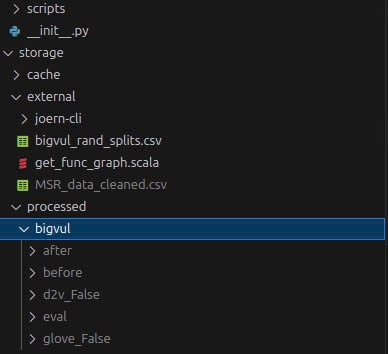
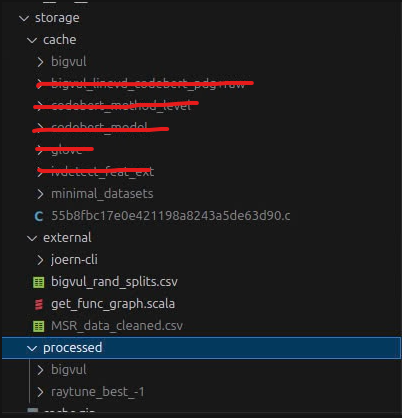

# Setup instruction

# Virtual environment setup

```python
python3 -m venv venv
source venv/bin/activate
```

# Install packages

```python
pip install -r requirements.txt
```

```python
pip install torch-scatter -f https://data.pyg.org/whl/torch-2.2.0+cu121.html
```

# Data setup

1. **Download from google drive the link**
[https://drive.google.com/drive/folders/1MOwFXA9mtj0lVOT3v0SHXYMlNG234ETC?usp=sharing](https://drive.google.com/drive/folders/1MOwFXA9mtj0lVOT3v0SHXYMlNG234ETC?usp=sharing)
2. **Unzip all the zip files in the directory**

After unzip the storage directory looks like the below image:




The cache directory looks like this:



# Training model

Notice there are some error in this step like the python ***can not identify custom module.***

The solution is to open terminal and **activate virtual environment again**

```python
source venv/bin/activate
```

Change to the running directory:

```python
cd sastvd/scripts
```

```python
python main.py
```